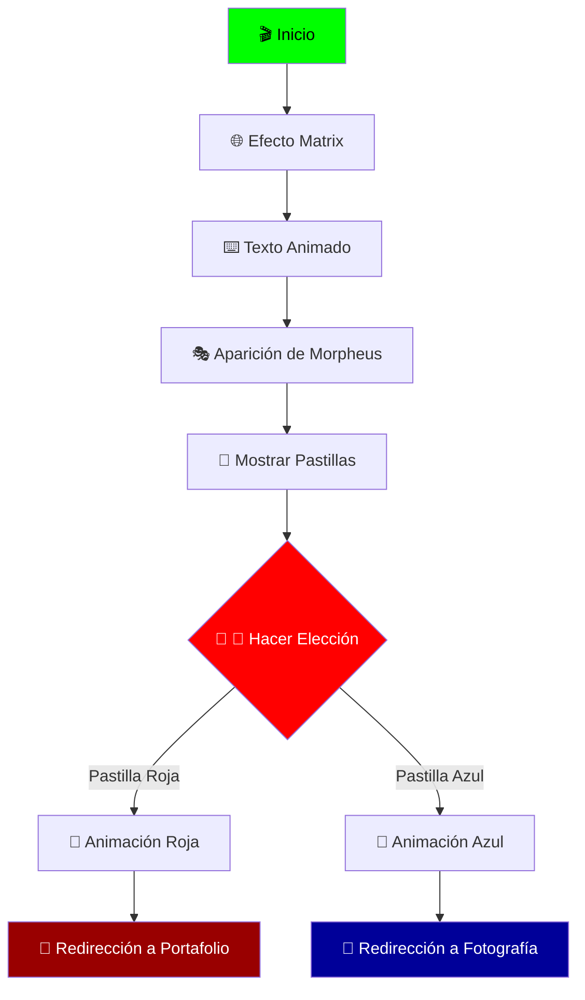

# 🎭 Red or Blue - The Choice

> **"Esta es tu última oportunidad. Después de esto, no hay vuelta atrás."** - Morpheus

Un mini-juego web inspirado en la icónica escena de **Matrix** donde debes elegir entre la pastilla roja 🔴 o la azul 🔵. Cada elección conduce a un destino diferente, integrando efectos visuales de la lluvia de código Matrix y diálogos dinámicos.


---

## 🚀 web-mini-juego

[](https://jhormancastella.github.io/Red-or-Blue/)

---

## ✨ Características Destacadas

<div align="center">

| Función | Descripción |
|---------|-------------|
| 🌐 **Efecto Matrix** | Lluvia de código en tiempo real con Canvas |
| ⌨️ **Máquina de Escribir** | Texto animado al estilo terminal |
| 🎭 **Diálogos Interactivos** | Mensajes que cambian al pasar el cursor |
| 🎨 **Animaciones CSS** | Transiciones suaves y efectos visuales |
| 📱 **Responsive Design** | Compatible con dispositivos móviles |

</div>

---

## 🕹️ Cómo Jugar

1. **Espera** a que cargue el efecto Matrix y el texto inicial
2. **Observa** la aparición de Morpheus y las pastillas
3. **Explora** las opciones pasando el cursor sobre cada pastilla
4. **Elige** tu destino:
   - 🔴 **Pastilla Roja**: "Descubre la verdad" → Te lleva al portafolio
   - 🔵 **Pastilla Azul**: "Sigue en la matrix" → Te lleva al sitio de fotografía

---

## 🛠️ Tecnologías Utilizadas

<div align="center">


</div>

---

## 📁 Estructura del Proyecto

```
red-or-blue-matrix-game/
├── index.html          # Archivo principal (HTML + CSS + JS integrados)
├── README.md           # Documentación del proyecto
└── assets/             # Carpeta de recursos (opcional)
    ├── images/         # Imágenes del proyecto
    └── sounds/         # Efectos de sonido (para futuras implementaciones)
```

---

## 🎯 Diagrama de Flujo



---

## 👨‍💻 Autor

**Jhorman Jesus Castellanos Morales** 

[](https://github.com/jhormancastella)
[]([https://linkedin.com/in/jhormancastella](https://www.linkedin.com/in/jhorman-jesus-castellanos-morales-245b97261/))

📅 **Derechos reservados © 2025**

---

## 📜 Licencia

Este proyecto está bajo la Licencia MIT. Ver el archivo `LICENSE` para más detalles.

[](https://opensource.org/licenses/MIT)

---

**¿Tomarás la pastilla roja 🔴 o la azul 🔵? La elección es tuya...**

```